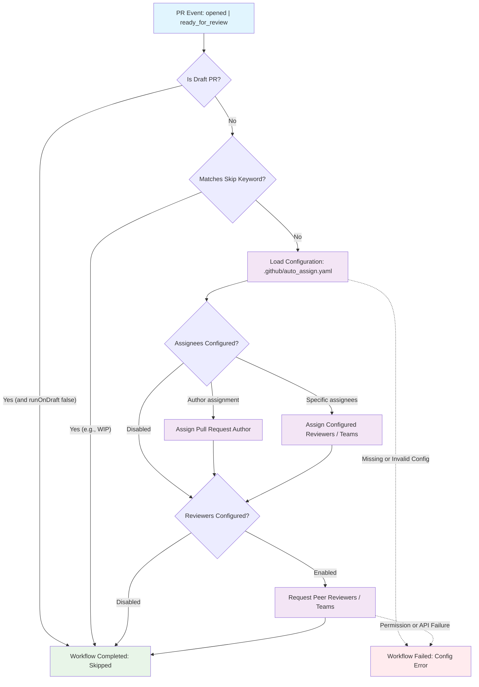

## Workflow Overview

**Purpose**: Automatically triage pull requests by assigning designated owners and requesting peer reviewers upon pull request creation or transition from draft status.
**Trigger Events**: `pull_request` activities (`opened`, `ready_for_review`)
**Target Environments**: GitHub Actions Runner (`ubuntu-slim` / Linux container) across consumer repositories

## Execution Flow Diagram



## Jobs & Dependencies

| Job Name | Purpose | Dependencies | Execution Context |
|----------|---------|--------------|-------------------|
| add-reviews | Evaluates pull request state and executes automatic assignee and reviewer assignments | None (standalone trigger) | GitHub-hosted runner (`ubuntu-slim`) |

## Requirements Matrix

### Functional Requirements

| ID | Requirement | Priority | Acceptance Criteria |
| ---- | ------------- | ---------- | ------------------- |
| REQ-001 | Automatic Author Assignment | High | PR author is added as an assignee when `addAssignees: author` is configured |
| REQ-002 | Peer Reviewer Requesting | High | Configured users and review groups are requested for review when `addReviewers: true` |
| REQ-003 | Title and Body Filtering | Medium | Assignment is skipped without failure when PR title or description includes skip keywords (e.g., `wip`) |
| REQ-004 | Lifecycle Event Response | High | Workflow triggers on both initial creation (`opened`) and status conversion (`ready_for_review`) |
| REQ-005 | Draft PR Gating | Medium | Default behavior defers reviewer assignment while PR remains in draft state unless explicitly overridden |
| REQ-006 | Allocation Limits | Low | Triage respects `numberOfAssignees` and `numberOfReviewers` limits to prevent over-subscription |

### Security Requirements

| ID | Requirement | Implementation Constraint |
|----|-------------|---------------------------|
| SEC-001 | Minimal Global Permissions | Root workflow level must declare `permissions: {}` |
| SEC-002 | Scoped Job Permissions | Job restricts write scope exclusively to `contents: write` and `pull-requests: write` |
| SEC-003 | Immutable Action Pinning | External actions must reference immutable full commit SHAs |
| SEC-004 | Fork Context Isolation | Standard `pull_request` event prevents leakage of write credentials to untrusted fork repositories |

### Performance Requirements

| ID | Metric | Target | Measurement Method |
|----|-------|--------|-------------------|
| PERF-001 | Execution Latency | < 30 seconds | Total workflow run duration recorded by GitHub Actions |
| PERF-002 | API Call Efficiency | <= 5 API requests per run | GitHub REST/GraphQL API rate limit accounting |
| PERF-003 | Cold Start Overhead | < 10 seconds | Runner initialization duration on `ubuntu-slim` |

## Input/Output Contracts

### Inputs

```yaml
# Configuration Contract (.github/auto_assign.yaml)
addReviewers: boolean          # Enable/disable automatic reviewer assignments
addAssignees: string | boolean # Assignment mode ('author', boolean, or explicit users)
numberOfAssignees: integer     # Upper bound for assignees (0 = all configured)
numberOfReviewers: integer     # Upper bound for reviewers (0 = all configured)
skipKeywords: list[string]     # Substrings in PR title/body indicating bypass (e.g., 'wip')
reviewers: list[string]        # Candidate reviewer GitHub usernames
reviewGroups: list[string]     # Candidate reviewer GitHub team slugs
assignees: list[string]        # Candidate assignee GitHub usernames
assigneeGroups: list[string]   # Candidate assignee GitHub team slugs
filterLabels: list[string]     # Required labels to trigger assignment (optional)
runOnDraft: boolean            # Whether to run assignment logic on draft PRs (default: false)

# Repository Triggers
pull_request:
  types:
    - opened
    - ready_for_review
```

### Outputs

```yaml
# Pull Request Mutations (Target State)
pr_assignees: list[string]        # Usernames successfully assigned to the pull request
pr_reviewers: list[string]        # Usernames successfully requested for pull request review
pr_review_groups: list[string]   # Team slugs successfully requested for pull request review
triage_status: string             # Outcome summary ('assigned' | 'skipped' | 'no-op')
```

### Secrets & Variables

| Type | Name | Purpose | Scope |
|------|------|---------|-------|
| Secret | GITHUB_TOKEN | Authorizes write operations against PR assignees and reviewers API | Step / Action Execution |
| Variable | CONFIGURATION_PATH | Relative repository path to triage rules (`.github/auto_assign.yaml`) | Action Step |

## Execution Constraints

### Runtime Constraints

- **Timeout**: Maximum execution time bounded at 5 minutes
- **Concurrency**: Handled per pull request event; concurrent pushes/events resolve idempotently via GitHub API
- **Resource Limits**: Standard Linux runner profile (1 vCPU, 500 MB RAM allocation sufficient)

### Environmental Constraints

- **Runner Requirements**: `ubuntu-slim` (or standard Linux x86_64 runner)
- **Network Access**: Outbound HTTPS (port 443) to `api.github.com`
- **Permissions**: `contents: write`, `pull-requests: write` at job scope

## Error Handling Strategy

| Error Type | Response | Recovery Action |
| ------------ | ---------- | ----------------- |
| Missing Configuration File | Workflow fails step with descriptive log | Ensure `.github/auto_assign.yaml` is committed to repository |
| Malformed Configuration Syntax | Workflow terminates step on YAML parser error | Validate syntax against YAML linter |
| Target User / Group Not Found | GitHub API returns 404 / 422 warning | Verify user or team exists and maintains repository read access |
| Insufficient Token Privileges | GitHub API returns 403 Forbidden | Ensure repository workflow permissions allow PR write operations |
| API Rate Limit Exceeded | Step terminates with HTTP 403 / 429 | Retry automatically via standard backoff or wait for window reset |

## Quality Gates

### Gate Definitions

| Gate | Criteria | Bypass Conditions |
| ------ | ---------- | ------------------- |
| Configuration Validation | `.github/auto_assign.yaml` exists and matches schema | Never bypassed |
| Draft State Gate | Pull request must be ready for review unless `runOnDraft: true` | Draft state active |
| Keyword Bypass Gate | Pull request title and body must not contain defined `skipKeywords` | Bypass keywords present |

## Monitoring & Observability

### Key Metrics

- **Success Rate**: Target >= 99.5% completion without unexpected failure
- **Execution Time**: P95 duration under 20 seconds
- **Resource Usage**: < 1 runner-minute per execution

### Alerting

| Condition | Severity | Notification Target |
|-----------|----------|-------------------|
| Workflow execution failure on default branch PRs | Warning | Pull request comments / DevOps triage team |
| Repeated GitHub API 403 permission failures | High | Repository administrator |

## Integration Points

### External Systems

| System | Integration Type | Data Exchange | SLA Requirements |
|--------|------------------|---------------|------------------|
| GitHub REST / GraphQL API | HTTPS API Client | PR metadata read, reviewer/assignee POST mutations | Availability >= 99.9% |

### Dependent Workflows

| Workflow | Relationship | Trigger Mechanism |
|----------|--------------|-------------------|
| PR Title & Conventional Commit Check | Parallel validation | Triggered independently on PR events |
| CI Test Suite / Super Linter | Downstream verification | Triggered independently on PR events |
| Branch Protection Policies | Downstream consumer | Relies on triage reviewers for merge sign-off |

## Compliance & Governance

### Audit Requirements

- **Execution Logs**: Workflow execution history and action logs preserved for 90 days
- **Approval Gates**: N/A (Automated metadata triage without build artifact generation)
- **Change Control**: Workflow and rule changes managed via PR review and tracked in `ghwm.lock`

### Security Controls

- **Access Control**: Principle of least privilege enforced via explicit top-level and job-level permission blocks
- **Secret Management**: Ephemeral GitHub Actions token utilized; no static personal access tokens stored
- **Vulnerability Scanning**: Automated Dependabot and registry checks against pinned third-party actions

## Edge Cases & Exceptions

### Scenario Matrix

| Scenario | Expected Behavior | Validation Method |
|----------|-------------------|-------------------|
| PR author is listed in reviewer pool | Author is excluded from reviewer requests to satisfy GitHub rules | Validate PR review requests do not include author |
| PR opened with 'WIP' in title | Workflow detects keyword and completes without applying assignments | Check execution logs for keyword match skip confirmation |
| PR created by bot (e.g., Dependabot) | Executes normally; skips reviewer requests if reviewers config excludes bot PRs | Verify bot PR assignees |
| Pull request from external fork | Job fails gracefully or operates read-only under standard PR permissions | Confirm secure isolation without exposing write tokens |
| Zero available reviewers in pool | Workflow completes successfully with zero reviewers requested | Verify job outcome is successful with no reviewers added |

## Validation Criteria

### Workflow Validation

- **VLD-001**: Workflow YAML syntax validates against GitHub Actions schema
- **VLD-002**: Automatic assignment of author triggers upon PR opening when configured
- **VLD-003**: Configured reviewers and review teams receive review requests on ready-for-review events
- **VLD-004**: Skip keywords prevent unwanted assignment actions
- **VLD-005**: Token permissions maintain least privilege boundaries

### Performance Benchmarks

- **PERF-001**: Execution completes in less than 20 seconds under normal GitHub API loads
- **PERF-002**: Workflow utilizes minimal runner compute resources (< 1 minute per run)

## Change Management

### Update Process

1. **Specification Update**: Modify this specification document to reflect new requirements or contract changes
2. **Review & Approval**: Core maintainers review and approve specification updates
3. **Implementation**: Update `workflows/auto-assign-pr/auto-assign-pr.yaml` and default configuration
4. **Testing**: Validate behavior against test pull requests in an integration repository
5. **Deployment**: Release updated workflow package via `ghwm` registry versioning

### Version History

| Version | Date | Changes | Author |
|---------|------|---------|--------|
| 1.0 | 2026-10-03 | Initial specification for auto-assign-pr workflow | DevOps Team |

## Related Specifications

- [Pull Request Title Check Specification](../pr-title-check/spec-process-cicd-pr-title-check.md)
- [Super Linter Specification](../super-linter/spec-process-cicd-super-linter.md)
- [Workflow Package Architecture Specification](../../spec/workflow-packaging.md)
