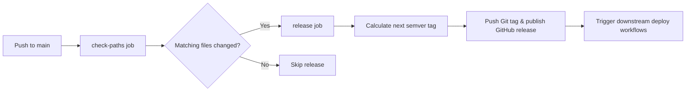

# Auto Release Workflow

The `auto-release` workflow automates semantic version tagging and GitHub release generation on merges to `main`. It enables external path filtering so consumer repositories can define release triggers without modifying the GHWM-managed workflow file.

## Source of Truth

- Registry repository: [ghwfxlab/ghwm-registry](https://github.com/ghwfxlab/ghwm-registry)
- Workflow source: [`workflows/auto-release/auto-release.yaml`](./auto-release.yaml)

## What Gets Installed

After running `ghwm install`, the consumer repository receives:

- `.github/workflows/auto-release.yaml`: The automated GitHub Actions release workflow.
- `.github/auto-release.yaml`: The repository-specific configuration file (supports YAML or JSON).
- An entry in `ghwm.lock`.

## How It Works

The workflow executes in two consecutive stages on pushes to `main`:



1. **`check-paths` Job**:
   - Reads [`.github/auto-release.yaml`](file:///.github/auto-release.yaml) (or `.yml` / `.json`) from the repository root.
   - Evaluates whether any files modified between the previous commit and the current HEAD match the configured path patterns.
   - Outputs `run_release=true` if changes match, or `run_release=false` to skip the release.
2. **`release` Job**:
   - Generates authentication token (GitHub App or fallback).
   - Computes the next version tag using `anothrNick/github-tag-action`.
   - Creates a published GitHub Release with auto-generated release notes using `softprops/action-gh-release`.

---

## Prerequisites & Setup

### 1. GitHub App Authentication (Recommended)

GitHub Actions has built-in loop protection: events created using the default `GITHUB_TOKEN` (such as publishing a release) **will not** trigger other workflows (e.g. `on: release: types: [published]` in a deployment pipeline).

To allow automated releases to trigger downstream deployment workflows:

1. Create or use an existing GitHub App with **`Contents: write`** permissions.
2. Install the GitHub App on your repository.
3. Configure the following repository or organization secrets:
   - `GH_APP_ID`: The App Client ID.
   - `GH_APP_PRIVATE_KEY`: The App's private key (PEM format).

> [!NOTE]
> If `GH_APP_ID` or `GH_APP_PRIVATE_KEY` are not set, the workflow automatically and gracefully falls back to `GITHUB_TOKEN`. Releases and Git tags will still be created, but downstream workflows will not be triggered automatically.

### 2. Path Configuration (`.github/auto-release.yaml`)

Because GHWM updates workflow files when you run `ghwm update`, path triggers are configured outside of the workflow file in `.github/auto-release.yaml`. This ensures your project's custom path rules are never overwritten by upstream workflow updates.

#### File Syntax

- The configuration uses standard YAML (or JSON at `.github/auto-release.json`).
- Patterns follow Git pathspec / glob syntax relative to the repository root.
- If `.github/auto-release.yaml` is missing or contains an empty `paths` list, **all** pushes to `main` will trigger a release.

#### Examples

**Frontend / TypeScript / Web:**

```yaml
paths:
  - "src/**"
  - "package.json"
  - "package-lock.json"
  - "tsconfig.json"
```

**.NET / C#:**

```yaml
paths:
  - "src/**/*.cs"
  - "*.sln"
  - "**/*.csproj"
```

**Rust:**

```yaml
paths:
  - "src/**"
  - "Cargo.toml"
  - "Cargo.lock"
```

**Go:**

```yaml
paths:
  - "**/*.go"
  - "go.mod"
  - "go.sum"
```

**Java (Maven / Gradle):**

```yaml
paths:
  - "src/main/**"
  - "pom.xml"
  - "build.gradle"
```

**Python:**

```yaml
paths:
  - "src/**"
  - "pyproject.toml"
  - "poetry.lock"
```

**Skipping docs-only or CI-only updates:**

By listing only code and release-critical directories under `paths:`, updates to `docs/**`, `README.md`, or test workflows will not trigger an unnecessary version bump or release candidate.

---

## Version Bumping Strategy

Version bumping follows semantic versioning (`MAJOR.MINOR.PATCH`):

| Trigger | Result | Example |
| --- | --- | --- |
| **Default (no tag in commit)** | Bumps **`patch`** | `v1.0.0` $\rightarrow$ `v1.0.1` |
| Commit message contains `#patch` | Bumps **`patch`** | `v1.0.0` $\rightarrow$ `v1.0.1` |
| Commit message contains `#minor` | Bumps **`minor`** | `v1.0.0` $\rightarrow$ `v1.1.0` |
| Commit message contains `#major` | Bumps **`major`** | `v1.0.0` $\rightarrow$ `v2.0.0` |
| Commit message contains `#none` | **Skips** release bump | No release created |

If multiple tags are present in the commit message, the highest-ranking tag takes precedence (`#major` > `#minor` > `#patch`).

---

## Permissions

The workflow declares minimum required permissions at the top level and elevates permissions only in the release job:

| Job | Permission | Level | Reason |
| --- | --- | --- | --- |
| `release` | `contents` | `write` | Pushing Git tags and creating GitHub releases |
