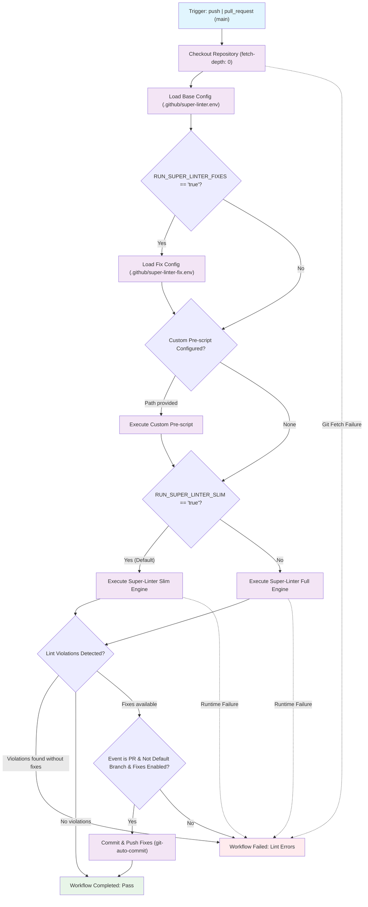

## Workflow Overview

**Purpose**: Execute automated static analysis, security scanning, syntax verification, and optional autoformatting across the codebase on pull requests and branch pushes.
**Trigger Events**: `pull_request` targeting `main`, `push` to `main`
**Target Environments**: GitHub Actions Runner (`ubuntu-24.04` / Linux container) across consumer repositories

## Execution Flow Diagram



## Jobs & Dependencies

| Job Name     | Purpose                                                                                                  | Dependencies          | Execution Context                     |
| ------------ | -------------------------------------------------------------------------------------------------------- | --------------------- | ------------------------------------- |
| super-linter | Executes multi-language static code analysis, security scanning, and optional automated formatting fixes | None (standalone job) | GitHub-hosted runner (`ubuntu-24.04`) |

## Requirements Matrix

### Functional Requirements

| ID      | Requirement                    | Priority | Acceptance Criteria                                                                                  |
| ------- | ------------------------------ | -------- | ---------------------------------------------------------------------------------------------------- |
| REQ-001 | Multi-Language Validation      | High     | Validates YAML, Markdown, JSON, GitHub Actions workflows, Makefiles, and Python across repository    |
| REQ-002 | Secret Leak Prevention         | High     | Scans Git commit history and working tree using Gitleaks to detect exposed credentials               |
| REQ-003 | Action Security Auditing       | High     | Analyzes GitHub Actions workflows using actionlint and zizmor for security antipatterns              |
| REQ-004 | Prose Terminology Verification | Medium   | Enforces natural language consistency and project terminology using textlint                         |
| REQ-005 | Dual Execution Modes           | High     | Supports lightweight slim container for rapid feedback and full container for deep language coverage |
| REQ-006 | Automated Fix Propagation      | Medium   | Automatically formats and commits lint fixes to pull request branches when autofixing is enabled     |
| REQ-007 | Pre-lint Custom Hooks          | Low      | Executes user-defined pre-lint setup scripts when `PRE_SUPER_LINTER_CUSTOM_SCRIPT_PATH` is specified |

### Security Requirements

| ID      | Requirement                  | Implementation Constraint                                                                                                 |
| ------- | ---------------------------- | ------------------------------------------------------------------------------------------------------------------------- |
| SEC-001 | Top-Level Permission Zeroing | Top-level workflow must set `permissions: {}` to prevent accidental privilege leakage                                     |
| SEC-002 | Job-Scoped Permissions       | Permissions restricted to `contents: write`, `issues: write`, `statuses: write`, `pull-requests: write`, `packages: read` |
| SEC-003 | Immutable Action Referencing | Third-party actions pinned to immutable 40-character Git commit SHAs                                                      |
| SEC-004 | Git Credential Hygiene       | Checkout step must disable credential persistence (`persist-credentials: false`)                                          |
| SEC-005 | Protected Branch Immunity    | Automated commits must never target the repository default branch (`main`) directly                                       |

### Performance Requirements

| ID       | Metric                    | Target                                                  | Measurement Method                      |
| -------- | ------------------------- | ------------------------------------------------------- | --------------------------------------- |
| PERF-001 | Slim Mode Run Duration    | < 3 minutes on standard PRs                             | Total GitHub Actions job execution time |
| PERF-002 | Full Mode Run Duration    | < 8 minutes on standard PRs                             | Total GitHub Actions job execution time |
| PERF-003 | Image Pull Overhead       | < 45 seconds for slim container                         | Container initialization phase latency  |
| PERF-004 | Incremental Diff Scanning | Process only modified files when Git history is present | Super-Linter commit range evaluation    |

## Input/Output Contracts

### Inputs

```yaml
# Environment Controls (Workflow Level)
PRE_SUPER_LINTER_CUSTOM_SCRIPT_PATH: string  # Optional path to executable script run before linting
SUPER_LINTER_CONFIG_PATH: string             # Path to base configuration file (default: .github/super-linter.env)
SUPER_LINTER_FIX_CONFIG_PATH: string         # Path to auto-fix configuration file (default: .github/super-linter-fix.env)
RUN_SUPER_LINTER_SLIM: boolean               # Toggle slim container (true) vs full container (false)
RUN_SUPER_LINTER_FIXES: boolean              # Toggle automated fixing and pushing (default: false)

# Linter Rules Configuration Directory (.github/linters/)
- .yaml-lint.yml                             # YAML syntax and formatting rules
- .markdown-lint.yml                         # Markdown style rules
- actionlint.yml                             # Workflow analysis rules and ignore patterns
- .gitleaks.toml                             # Secret detection rules and allow-lists
- .textlintrc                                # Prose terminology and style dictionary
- .textlintignore                            # Excluded file paths for prose validation

# Repository Triggers
pull_request:
  branches: [main]
push:
  branches: [main]
```

### Outputs

```yaml
# Commit Status & Checks
commit_status: string # Pass/fail status check reported back to GitHub commit
step_summary: markdown # Formatted markdown summary of linter findings

# Repository Mutations (when RUN_SUPER_LINTER_FIXES: true)
remediated_commit: git_commit # Automated fix commit pushed to head branch
commit_message: string # "chore[BOT]: fix linter issues"
```

### Secrets & Variables

| Type     | Name                         | Purpose                                                                            | Scope                |
| -------- | ---------------------------- | ---------------------------------------------------------------------------------- | -------------------- |
| Secret   | GITHUB_TOKEN                 | Authenticates Super-Linter for status checks, comments, and automated push commits | Job Execution        |
| Variable | SUPER_LINTER_CONFIG_PATH     | Custom configuration file path override                                            | Workflow Environment |
| Variable | SUPER_LINTER_FIX_CONFIG_PATH | Custom autofix configuration file path override                                    | Workflow Environment |

## Execution Constraints

### Runtime Constraints

- **Timeout**: Bounded by GitHub Actions default (recommended explicit 15-minute job timeout)
- **Concurrency**: Governed by GitHub Actions concurrency groups or branch push sequencing
- **Resource Limits**: Ubuntu runner (2 vCPUs, 7 GB RAM, 14 GB SSD storage)

### Environmental Constraints

- **Runner Requirements**: `ubuntu-24.04` (Linux x86_64 host environment with Docker daemon support)
- **Network Access**: Outbound HTTPS (port 443) to `ghcr.io`, `docker.io`, and `api.github.com`
- **Permissions**: Write access to contents, pull requests, issues, and commit statuses

## Error Handling Strategy

| Error Type                    | Response                                         | Recovery Action                                                                      |
| ----------------------------- | ------------------------------------------------ | ------------------------------------------------------------------------------------ |
| Linter rule Violations        | Workflow fails job and annotates offending files | Developers resolve reported errors locally or review committed auto-fixes            |
| Secret Detected by Gitleaks   | Immediate job termination with security alert    | Revoke compromised credential immediately, rotate secret, and purge from Git history |
| Configuration Syntax Error    | Step fails during config file parse              | Correct YAML, TOML, or environment file syntax in `.github/linters/`                 |
| Merge Conflict on Auto-Commit | Git push fails if branch head moved              | Developer pulls latest branch changes and re-triggers workflow                       |
| Container Pull Failure        | Docker daemon returns registry error             | Transient retry; inspect network connectivity to GitHub Container Registry           |

## Quality Gates

### Gate Definitions

| Gate                      | Criteria                                          | Bypass Conditions                                             |
| ------------------------- | ------------------------------------------------- | ------------------------------------------------------------- |
| Zero Secrets Leaked       | Gitleaks returns 0 detected patterns              | Explicit allow-list entry in `.github/linters/.gitleaks.toml` |
| Syntax Validity           | All enabled language linters pass with 0 errors   | Per-validator disable flag (`VALIDATE_<LANG>=false`)          |
| Action Security Audit     | Zero high-severity workflow security antipatterns | Documented rule exclusion in `actionlint.yml`                 |
| Documentation Consistency | Markdown and textlint rules pass clean            | Exclusions defined in `.textlintrc` or `.textlintignore`      |

## Monitoring & Observability

### Key Metrics

- **Success Rate**: Target >= 98% clean runs across pull requests
- **Execution Time**: Average < 2 minutes for slim runs on incremental changes
- **Autofix Frequency**: Ratio of PR runs resulting in automated remediation commits

### Alerting

| Condition                                   | Severity | Notification Target              |
| ------------------------------------------- | -------- | -------------------------------- |
| Gitleaks credential exposure detected       | Critical | Security triage team & PR author |
| Workflow failure on default branch (`main`) | High     | Repository maintainers           |
| Auto-commit push permission failure         | Medium   | DevOps triage                    |

## Integration Points

### External Systems

| System                           | Integration Type      | Data Exchange                                      | SLA Requirements      |
| -------------------------------- | --------------------- | -------------------------------------------------- | --------------------- |
| GitHub Container Registry (GHCR) | Docker Image Registry | Pulls `super-linter/super-linter` container images | Availability >= 99.9% |
| GitHub Checks API                | REST / GraphQL        | Publishes annotations, check status, and summaries | Availability >= 99.9% |

### Dependent Workflows

| Workflow                             | Relationship         | Trigger Mechanism                                   |
| ------------------------------------ | -------------------- | --------------------------------------------------- |
| Auto Assign PR                       | Parallel peer        | Triggers concurrently on PR lifecycle events        |
| PR Title & Conventional Commit Check | Parallel peer        | Evaluates commit message and PR title validity      |
| Branch Protection Rule               | Enforcement consumer | Requires `Lint Code Base` status check before merge |

## Compliance & Governance

### Audit Requirements

- **Execution Logs**: Full linter output logs preserved for 90 days in GitHub Actions
- **Approval Gates**: Status check required for pull request merge under branch protection rules
- **Change Control**: Rule changes in `.github/linters/` require pull request review and version locking in `ghwm`

### Security Controls

- **Access Control**: Scoped GITHUB_TOKEN permissions preventing privilege escalation
- **Secret Management**: Native ephemeral credentials; no persistent credentials stored on runner
- **Vulnerability Scanning**: Weekly action dependency updates via Dependabot targeting pinned commit hashes

## Edge Cases & Exceptions

### Scenario Matrix

| Scenario                           | Expected Behavior                                                                         | Validation Method                                  |
| ---------------------------------- | ----------------------------------------------------------------------------------------- | -------------------------------------------------- |
| Pull request from external fork    | Auto-commit step skips automatically due to token permissions; linting proceeds read-only | Verify run passes or fails without attempting push |
| Full codebase scan on initial push | Scans all repository files without merge-base diff optimization                           | Check log indicates `VALIDATE_ALL_CODEBASE=true`   |
| Large binary file committed        | Skipped by text and code linters based on path/type filters                               | Verify job duration is not adversely impacted      |
| Pre-lint script fails              | Step terminates immediately, halting linter execution                                     | Check step exit code and execution log             |
| Fast-forward push to `main` branch | Runs validation in push mode; auto-commit step bypassed                                   | Confirm no commits generated directly on `main`    |

## Validation Criteria

### Workflow Validation

- **VLD-001**: YAML syntax adheres strictly to GitHub Actions schema specification
- **VLD-002**: Super-Linter slim image launches and executes successfully on `ubuntu-24.04`
- **VLD-003**: Configured linters correctly flag known test violations
- **VLD-004**: autofix engine cleanly commits and pushes valid formatting changes on branch PRs
- **VLD-005**: Gitleaks triggers immediate failure upon synthetic token injection

### Performance Benchmarks

- **PERF-001**: Slim mode completes in under 120 seconds on standard code changes
- **PERF-002**: Auto-commit cycle completes within 15 seconds after linting completion

## Change Management

### Update Process

1. **Specification Update**: Amend this document with modified requirements, new linter scopes, or updated constraints
2. **Review & Approval**: Core maintainers review and approve specification changes
3. **Implementation**: Modify `workflows/super-linter/super-linter.yaml` and `.github/linters/` configurations
4. **Testing**: Run local validations via `make super-linter` or test against sample pull requests
5. **Deployment**: Publish updated package through `ghwm` registry versioning

### Version History

| Version | Date       | Changes                                         | Author      |
| ------- | ---------- | ----------------------------------------------- | ----------- |
| 1.0     | 2026-10-03 | Initial specification for super-linter workflow | DevOps Team |

## Related Specifications

- [Auto Assign PR Specification](../auto-assign-pr/spec-process-cicd-auto-assign-pr.md)
- [Pull Request Title Check Specification](../pr-title-check/spec-process-cicd-pr-title-check.md)
- [Workflow Package Architecture Specification](../../spec/workflow-packaging.md)
